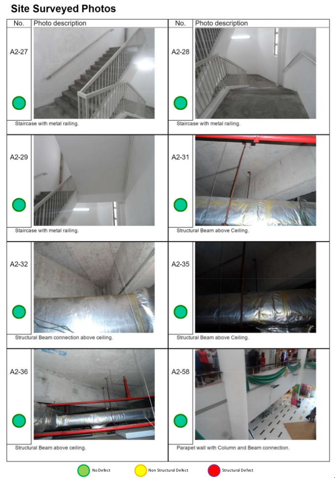

\pagebreak

# Introduction

These are my notes I've written to prepare for the OGP job interview.

**I've confirmed the final interview date with OGP on the 27th of
October 2020.**

> I'll leave any detailed feedback e.g. on the technical assessments to
> after the whole interview process is over, as that is what we
> typically do for all of our candidates. In general, the interviewers
> did find that you were competent and showed familiarity at coding. As
> Hong's interview would focus more on your engineering experiences and
> decision-making, I'd encourage you to focus even more in terms of the
> depth of the work you did, what you found particularly interesting in
> the things you've done with regard to engineering, your thought
> process behind engineering decisions you've made and the trade-offs of
> those decisions etc.

**I've confirmed the interview date with OGP on 7th October 2020, 4pm to
6pm.**

From the [OGP Interview Guide (GDocs
link)](https://docs.google.com/document/d/1Y0X2hatsN-kbzVu9ICVJyeB67V1PyrqtOV7Cg94Btc4/edit):

> We will be looking at your resume and getting you to share more about
> what you have worked on in the past. We're interested in depth instead
> of breadth, so err on the side of specificity. Be prepared to share
> technical details about what you've worked on, including drawing
> diagrams on the whiteboard if necessary (for on-site interviews).

> In particular, we're trying to answer the following questions about
> you:
>
> - What did you do?
> - How is it impressive?
> - How did you do it?

> In addition, we're very interested in finding out how you think and
> how you work, so it would be useful to come prepared to explain any
> interesting engineering decisions that you had to make in the course
> of your work.

So what I'm going to do:

1.  Keep practicing leetcode (but i think this is lower priority atm)
2.  Write "talking points" for each of my projects:
    - what was it?
    - why was it important?
    - what was the architecture?
      - prepare diagram, talk about data flow.
      - what was the stack?
      - what were the interesting technical decisions I made?
    - any interesting technical challenges?
    - what mistakes did I make/what would I change if I were doing it
      now?
    - what have I learned?
3.  Prepare answers to behavioural questions:
    - favourite project?
    - tell me about a time you had a disagreement/made a mistake ...

---

# Self-introduction

I'm Zhenghong and I've just graduated from the University of Oxford
where I read Philosophy, Politics, and Economics. Despite what my degree
might suggest, I've always been incredibly interested in computer
science and so I've done courses in algos and DS, computer architecture,
functional programming and so on.

I like SWE a lot because I like to design and build things with
measurable impact, and I love delighting my users. (It also scratches my
creative itch).

Previously, I built an Electron app for a civil engineering firm which
streamlined their building inspection process a lot. It saved about 300
engineer-hours a month. I found this very rewarding because I could see
directly how my app improved their workflow and delighted the engineers.

In a previous internship I designed and built an automated SMS sender.
It uses Bayesian statistics and unique tracking URLs to send optimal
reminder messages. Seeing the number of active users increase day-by-day
was really wonderful.

I always have a backlog of new ideas and love building side projects.
I'm currently building a real-time, multiplayer board game engine with
TypeScript, React, and ExpressJS, and am trying to write and sell the
best puzzle books that money can buy on Amazon.

I think the work OGP does aligns very well with my own desire to delight
users and build software that matters.

---

# Behaviourals

## Overall strategy

This is who I am (only the good bits, anyway---see Weaknesses section
for the bad bits):

1.  I am someone who is relentlessly focused on _shipping things_: that
    is, build up a finished product and ship it to users within a short
    timespan.
2.  I care a lot about delighting users and making sure that they have
    the best experience.
3.  I am someone who has lots of experience building up a project from
    zero, learn whatever is needed on the job, and get an MVP out very
    quickly..
4.  I am someone who is quite pragmatic: I can strike the right balance
    between doing the "right" thing and doing a more bodge-job that is
    good enough (complexity/maintainability vs velocity)

This is a good positive image to convey because OGP has a startup
culture working in sprints. The main difference between OGP and the rest
of GovTech is not---as I previously thought--- building products for the
citizen vs. building products for civil service, but rather about the
process: it's more of startup culture, iterating quickly, having annual
monthly hackathons to iterate and ideate, rather than a more
requirements-driven development process.

How do I demonstrate this? Every single project I talk about should
point to at least one of those qualities.

**Shipping**:

- Inspector's Gadget (iteration to release in one month),
- Inzura data science pipeline (iteration to final report in three
  weeks),
- Cryptogram book (zero to published book in a weekend)
- Bayesian SMS pipeloop (building out the entire system in a week)

**Delighting users**:

- Inspector's Gadget (relentless focus on user experience/needs)
- Board Game Engine (always thinking about how to make the users
  happy)
- Cryptogram book (goal is to make the best cryptogram book that money
  can buy)

**Building from zero**: most of my projects have been from zero. Very
comfortable with starting _tabula rasa_, familiar with webdev concepts
like how to spin up the correct servers and set up the basic components
etc.

- multiplayer board game engine,
- Bayesian SMS pipeline,
- army WITS project,

**Pragmatic**: I can do bodge jobs when needed (Bayesian SMS pipeline)
but when I have the luxury of time I will make an effort to do things
the "right" way (board game engine).

## Why do you want to join OGP?

The more I read about and hear about OGP from the people I've spoken
with and interviewed with, the more I want to be part of the team.

Their mission from the website really couldn't have been written better
to attract me (all three points resonate deeply with me):

**Solve Real Problems**: Work on meaningful projects from transport to
healthcare. Don't waste your skills building another shopping cart.

**Build for the User**: Design and build products based on what real
people actually need. We don't serve bosses or bureaucracies. We serve
the public.

**Push For Change**: Actively prototype and evangelize ideas to make
real things happen. Work around or cut through bureaucracy.

### I want to be on a team working on meaningful projects

I like that OGP is building meaningful projects with measurable impact:
I find it incredibly difficult to work on someting I don't find
meaningful, and I think it's incredibly important to measure everything
you can so you know if you're actually doing good work.

### I want to be on a team that delights users rather than phoning it in.

I love that OGP puts an emphasis on delighting users. I care a lot about
that. A lot of stuff nowadays is user-hostile (usually because of
incompetence, indifference, or profit reasons): and many users regard
using the software as a chore or a barrier. But it's possible (!) to
build software that delights, websites and apps that users love to open
and scroll around and play with. Software that sparks joy. From what
I've read and heard, OGP also cares a lot about delighting users, and I
resonate with that a lot. I always think about my users: when designing
the board game engine I put a lot of work into how the schema would be
intuitive for users/minimise the new abstractions they need to learn.
When building the cryptogram books I read all the Amazon reviews for the
top-selling cryptogram books and put effort into fixing all of them.

I also think a lot of problems are XY problems. IMO, solving an XY problem
is a mark of distinction, because it implies that you've put in a lot of
effort to understand the problem domain and the users' needs, and
actually solve their root problem. An example of an XY problem I solved
is when I built Inspector's Gadget. I read a news article about how OGP
solved an XY problem when building a search app for SPF:

> Even though the users were asking for a lot of AI features, the actual
> problem that we decided to fix was the speed of the database. The idea
> was to make JARVIS like Google --- even if you don't get what you want
> the first time, you can just search again and get another set of
> results really quickly.\"

And this predictive search by Nikhil really shows attention to detail
and a will to delight users:

> Software engineer Nikhil Choudhary programmed JARVIS to surface any
> potential relevant details and suggestions the moment the officer
> pressed a key, instead of when he or she lifted his or her finger from
> it, which, interestingly, also saves several milliseconds in search
> time.

That feature was certainly not necessary but the fact that Nikhil went
the extra mile to put that in just speaks volumes about what sort of
organisation OGP is and what kind of people are in there and so I really
want to be part of it.

### I appreciate the autonomy and the fact that engineers are expected to push for change

I spoke to Nikhil and Chin Ying after the interview and they both
independently pointed to the _autonomy_ as being the best part of
working for OGP. I understand autonomy as having two parts, both of
which I really admire.

First: autonomy in terms of flexible working arrangements. I think that
displays a deep respect and trust in the _drive_ of your employees. and
puts boss/employee in a collaborative rather than adversarial
relationship. We all want to build awesome software---we should all be
on the same team, even if some of us need an occasional kick in the butt
to do it. My own work output can be quite bimodal (more on this later)
so I really appreciate this flexibility.

Second: autonomy in terms of _empowerment_. Nikhil and Chin Ying
mentioned that employees are expected to actively seek out problems that
they've observed and then build a prototype/MVP to fix it (monthly
hackathons). This again shows a deep respect and trust in the
_competence_ of your employees, in the sense that you trust that your
people will be able to find and fix problems of their own, instead of
them simply implementing a project being dictated from up high. I
completely agree with this. I think that if you expect more from people
you get more out of them. I consider myself very much a self-starter (my
scholarship, working paper collaborations and internships were all
gotten through the initial cold emails), so I really want to be part of
an organisation that encourages and empowers their employees to be
proactive in finding problems and fixing them.

### I appreciate the flat hierarchy and I believe in you

Some not-very-flattering questions that occasionally come to my mind
when working at IMDA:

- Why are we doing this?
- Is this project actually useful for Singapore, or is it just sexy
  with a lot of buzzwords?
- Are we doing this to meet some Senior Director's KPI/make them look
  good?

From everything that I've seen and heard, I believe that you really care
about benefiting Singapore and don't care about more venal
considerations like looking good/getting promoted. To be clear, I do
believe that the people up top in IMDA care a lot too: it's just that
the message may have gotten lost in transit after passing through the
Byzantine civil service apparatus. Another advantage of the flat
hierarchy.

## What's your greatest weakness?

- I find it difficult to muster up the motivation to work on something
  I don't see the point in doing. I think it makes me a rather
  difficult employee. My previous boss was very accommodating and I
  really appreciated it. He didn't get offended when I said "I don't
  really want to work on this task because I don't see the point in
  it", even though he was the boss and had every right to order me
  around. He would take the time to explain _why_ it was important
  that I did the task he assigned and then I would be convinced to do
  it.

- I'm also quite bimodal in my work. I have days where I didn't sleep
  well or whatever and don't get any work done, but I also have days
  where I'm _uber_ productive and just get many days' work done in
  one. Thankfully I think it averages out to make me more productive
  than average, but I really admire people who are able to put in
  consistent work every day.

- Something that's both a weakness and a strength is that I'm always
  full of new ideas/new questions. It's a weakness because I
  constantly have a long and growing backlog of posts/side project
  ideas. I used to be quite guilty about abandoning side projects but
  now I take a more balanced view: if it's really an interesting
  question/idea I have found that I am able to come back in a few
  months' time and it will still be interesting

- I can be quite blunt and straightforward, which sometimes alienates
  or discomforts people, although I've gotten somewhat more tactful as
  I've gotten older.

- In terms of more technical/engineering weaknesses: I am still
  relatively inexperienced when it comes to working together with
  other SWEs on a codebase. My previous projects have all been solo
  (e.g. side projects) or I just worked on building something that was
  separate from the rest of the codebase/engineers.

- I also want to try TDD/learn how to write unit tests but no team
  I've worked on has ever done it so I don't know how to do it
  "properly". What I usually do is try to type things even in
  dynamically typed languages + write assert statements throughout the
  code but I know this is not proper.

## What are your strengths?

- Because I'm self-taught, and I learned mainly from building
  projects, I know a lot about how to build projects from scratch.
  I've also had quite some practice on how to architect a system from
  scratch, which is something I quite enjoy.

- I'm a quick learner and I'm very comfortable being out of my depth
  because it means I get to learn new things. I think that's how I
  learn best, actually. In every project I always try to bite off more
  than I can chew, (or be very ambitious in increasing the technical
  complexity --- NOT necessarily scope), and it always works out for
  me.

- As mentioned, I'm always full of new ideas and new questions (see my
  blog posts for examples), and I think this attitude is a great fit
  for OGP-style organisation. Ditto with being a self-starter.

# Questions to ask

## Questions to ask Hongyi

- Where do you see yourself in five years? How will OGP survive your
  departure?
- Is there any friction between OGP and the rest of the agencies?
- OGP moves fast, government moves slow. How do you and the team deal
  with bureaucracy?

## Questions to ask Nikhil and Chin Ying

- What's your favourite thing about working for OGP?
- What do you dislike most about OGP?
- What do you wish someone had told you before you joined OGP?
- Do you ever think of leaving? If so, where would you go?

> Ask them why they decided to join the company. Ask them what they
> think the company could improve at. Ask them about a time that they
> messed up and how it was handled. Ask them how they see themselves
> growing at this company in the next few years. Ask them what they wish
> someone would have told them before they joined. Ask them if they ever
> think about leaving, and if they were to leave, where they would go.

# How I make technical decisions

I tend to view any technical decision
as a balancing act between six competing factors.

While preparing for the interview I examined all the individual technical
and engineering decisions that I have made in the past and I wondered to myself:
_why_ did I make the decisions that I made? What did I consider,
and how did I come to a conclusion?
And after some thought, I concluded that I tend to view any technical decision
as a balancing act between many competing factors.

I've come up with a taxonomy of trade-offs, split into two dyads of trios:
I have never actively _used_ this taxonomy,
but I definitely weigh these in my mind
even if they never bubbled up to the level of formal analysis.
But I'll take it for a test drive in my future engineering decisions
to see if this formalism is helpful.

By no means is this taxonomy universal or exhaustive:
it just happens to be the factors that _I've_ considered when building the
kind of software that I build.

## Developer-facing

1. Complexity: how hard is the codebase to understand/build/reason
   about? In general, complexity is king: complexity has knock-on effects
   on both maintainability and velocity.
2. Maintainability: how hard is it to maintain, extend, or modify the
   codebase over a period of time?
3. Velocity: how fast can you write and ship your code?

## User-facing

1. Performance: how quickly does the code run?
2. Robustness: how well does the codebase handle unexpected behaviour
   (e.g. packet drops, user clicks Submit twice)? how well does your code scale?
3. User-friendliness: how intuitive are your interfaces/abstractions?

Here are some examples of technical decisions I've made in the past
and how they fit in the taxonomy:

### Complexity

Complexity is king by a mile.
Any line of code you add,
any framework or library you pull in,
everything adds complexity.
And complexity has knock-on effects on maintainability and velocity.
The more complex your code is, the harder it gets to fit it in your head/
reason about it, and thus maintaining/extending/debugging becomes slower and
more difficult.
This has been alluded to in other writings about a "complexity budget"
for projects, and I completely agree.
I always think very hard before adding a framework or library to my codebase.

But sometimes we have to make things more complex, either because you're
doing something really non-trivial, or there's some big gain in one of the other
factors to be had in return.
Here are some examples where I traded one for the other:

- **Complexity vs Maintainability**:

For instance, bringing in a framework like React or a
library like TypeScript increases maintainability
but it imposes an up-front complexity cost.

The decision to use React in the WITS army app was a poor decision because
I got very little out of it.
React increases maintainability
because it mandates one-way data flow and so there is a single source of truth/
app state is easier to reason about,
which is mandatory when you have a lot of different components.
But there is an up-front complexity cost to using React.
You have to understand the React abstraction, you have to learn JSX,
you will need to start using a build system, and so on.
And maintainability came at a cost to complexity.
React made my code more verbose because one-way data flow
meant that you could not edit properties directly `onClick`:
had to "bubble up" callback events all the way up in order to mutate the
grandparent state. This is completely intended behaviour, but
for a simple app like mine, this was overkill because the
state was simple and reasoning about it would be fine regardless.

On the other hand, our choice to rewrite our codebase in TypeScript
in the board game engine project was a good one.
Migrating might alienate potential contributors that
didn't know TypeScript, and makes the stack more complex/harder to
build (indeed we ran into problems with CommonJS `require` vs module
`import` which wasted several man-days of dev time) but the typing
gives us a lot of increased maintainability. After not looking at
the code for weeks, having the types helps you understand the
codebase so much quicker, plus it also catches bugs when writing
code, so I feel the trade-off was worth it in the end.

**Complexity vs Velocity**: If we copy-paste stuff,
use single-letter variable names, or
import lots of third-party libraries, or even use a framework
that is meant to speed up development, we can ship
faster, but it makes the code more difficult to understand and
build, and you don't understand the codebase as well.

**Complexity vs Performance**: the speed of _execution_
(performance of the code). If your code is not running quickly enough,
you may have to optimise the run time and that often means making the code more
complex by doing hitherto-unnecessary things (indexing,
batching, more complicated/less straightforward algorithm,
calling functions in another language (e.g. Python), rewriting
in another language).

An example from my own experience: building the new feature for MGGG's
flagship webapp.

1.  Calculate on client-side or server-side?
2.  Send deltas or full district assignment?

**Send client-side vs server-side**: Client-side had less complexity,
but worse performance. I decided to spin up a server in the end.

Server-side would introduce more complexity and decrease maintainability.
You have to spin up a server, another thing to worry about,
new set of credentials to handover, etc...

However, gains in performance and velocity: no first-load latency
and I was able to use an Python library to perform many of the calculations
instead of rewriting them in JavaScript.
And while introducing a library does introduce complexity,
MGGG was actively developing that Python open-source library, so it was OK.

**Sending full district assignment vs deltas**: One way I considered to increase
performance was to not send the
full district assignment (a dictionary of int:int pairs) but rather only
the deltas (the assignments that have changed since the last district
assignment). While this would decrease latency,
I decided that this was more trouble than it was worth
since that would mean the server would have to maintain state.

**Complexity vs Robustness**:

_Robustness is not correctness!_ Correctness of the code means that
it must give the correct answer for all valid inputs (happy case).
I'm more talking about failing gracefully for wrong inputs.

I have never considered this at length until I started building the multiplayer
engine.

**Complexity vs User-friendliness**: why I used Electron to package up
Inspector's Gadget rather than simply spinning up a Node.js server.

**Maintainability vs Velocity**: This is the notion of "technical debt".
You can go faster by writing code "wrongly" but you will eventually need to
refactor.

An example: Inzura Bayesian SMS sender.

# Projects I've done

## Board game engine

### Project in five minutes: interesting engineering decisions.

1.  Efficient data structures
    - how they affect events (engineering) and the user experience
2.  Not unnecessarily polluting the codebase with async functions
3.  (Two JSON files versus one)
    - Server-side file that represents the abstract game state
    - Client-side file (aesthetics) that maps entity states and zones
      to images

### Brief background/motivation

I like playing and designing board games. During Covid 19, I wanted to
prototype and playtest a board game with my friends, but I couldn't find
a good tool to do so.

I wanted to build something that made it super easy to create and play
any board game online with friends with no downloads or programming
skill needed. You specify a board game with a JSON file or with a GUI
editor. You can then immediately host that game and send your friends
the link --- everything should be seamless.

### What it was

The board game engine is made out of three main parts.


First, it's the schema that allows anyone to specify and render any
board game with just two JSON files.

Second, it's the core multiplayer engine that synchronises player input
and maintains an authoritative game state between all the different
players.

Lastly, it'll be the "supporting infrastructure": a database to allow
players to upload JSON files, some front-end that allows players to host
and join games, etc.

I recruited two fellow gamedevs I met during an online Game Jam and
we've been working on it since. I personally designed the JSON data
schema, I've been managing/coordinating/overseeing the project,
enforcing good programming practices (moving to TypeScript)

We have an artist/UI designer, Shan. He did the aesthetics of the UI and
he did a mockup in HTML which I migrated to TypeScript.

Another person cloned a networking repo which unfortunately didn't
survive the migration to Typescript. We're slowly reintroducing and
improving upon it, and we're doing that with pair programming. We sat
down together to implement the netcode and I was in the driver seat
because I had more experience with JavaScript/webdev.

The first part (JSON schema) is completed, and we're almost done with
the MVP of the second part.

**If you have more experience in webdev, why did Joshua write the
architecture?**

This is a group project so we just decided to split up the work. Joshua
would handle the back-end and I would handle the front-end. Because I
had more experience I implemented my part before he did, and so we moved
on to pair programming to utilise both his architecture knowledge and my
ability to code quickly in the language.

**What I did:** I built the entire client side of the network: designed
the JSON schema, reading in the JSON files, initialising the game state,
handling actions, sending actions to the server.

### Why it was impressive/ why it was important

This is a passion side project so progress is pretty slow. But I've done
quite a lot of market research and I know that there's nothing like this
in the market. In terms of web, the closest is something like
Cockatrice/Lackey for multiplayer card games or Roll20 for Dungeons and
Dragons, but these are not ideal for board games. So we're filling a
small niche here --- the ability to prototype and playtest quickly is
really useful for board game nerds. We are delighting these users by
building something they desperately want but don't yet know they want!

### What was the architecture?

#### Diagram


This is a client-server architecture. Clients send prospective actions
(e.g. move an object, change an object's state etc.) to the server over
WebSockets . The server does conflict resolution and returns the
authoritative set of actions.

Right now, a single server handles both the HTTP requests and Websockets
communication. For scale in the future, we would probably want to
separate the server that serves the static assets and handles the HTTP
GET/POST requests from the game server that does the heavy lifting of
synchronising player input and game state over WebSockets.

    // Left-click an object to enter "drag" mode, then
    // move the mouse anywhere to move the entity's position.
    // Left-click again to drop the entity.
    // Note that this doesn't change the entity's zone.

    //             Change State Mode
    //                    ^
    //                    |
    //                    |
    // Base Mode --> Entity UI Mode -->  Change Position Mode
    //   |  ^             |
    //   |  |             |
    //   v  |             v
    // Drag mode    Change Zone mode

    // We will also have a ContextMenu that is generated
    // and probably also some flags like CurrentlyDraggingEntity
    // and EntityCurrentlyDragged

    //
    //                                ________________                _________
    //                                |               |               |        |
    // UI [posx, posy, LMB, RMB] ===> |    GameCore   | Action[] ===> | Server |
    //                                |_______________|          <=== |________|
    //                                        |
    //                                        | Action[]
    //                                        v
    //                                    GameState
    //

#### Dataflow and stack

Because we're designing for web, the only real choice is Javascript.

I decided to use TypeScript because I find types one of the most
important things I use to reason about complicated code. They act as a
sanity check to ensure I'm not passing the wrong parameters when calling
functions, which in JavaScript will usually silently fail. With
TypeScript I can define custom structs/interfaces and that makes writing
methods so much easier.

#### Interesting technical decisions I made?

##### We didn't try to represent the rules of any game.

The main decision was to deliberately reduce the scope of the data
schema. We don't try to represent the rules of any board game. Instead
we simply represent entities, zones, and the states that those entities
can have (e.g. face up vs face down). This allows us to represent any
analogue board game at the cost of not being able to have AI/enforce
game rules. The choice of the DSL and its syntax allows for an efficient
representation of state and allows us to make transformations on that
data easily.

**How**: By not having the rules of the game be in in the data schema
representing the game, it makes it much easier for end users to specify
a game.

**The representation of events**: Because we don't have any rules, we
can represent any analogue board game. Our events are also "real events"
in the sense that they correspond to real actions users would take when
playing the analogue board game, which makes them easy to work with and
reason about.

I thought a lot about the user experience when designing the schema:

1.  The objects in the data schema resemble the objects that users are
    used to e.g. spaces (zones) and tokens (entities)
2.  We're able to curate the set of events to be small and finite so
    that it is _minimally_ useful and there is only ever one event to
    perform a certain action

Our engineering contructs match ideas that players/builders use
themselves. Abstractions are similar to the abstractions that
players/builders use. Like Zones and Entities and Players map well to
things that players already intuitively understand.

Simple but extensible architecture Keep the game state minimal and easy
to work with --- make it as easy as possible for the player/builder to
feed in the data structure.

##### We chose a particular schema for engineering reasons

We chose a data schema that works well from an engineering perspective
that also works well for users. Zones are immutable and they have
permissions attached to them that entities don't and they are also
supposed to be rendered under entities (z-index).

Entities also have common properties that make sense to treat them
together.

This was not the only way we could have done it. On the one hand, we
could have gone for more granularity on the entities, splitting them
into "tokens", "cards", and "dice".

(e.g. tokens have one state, cards have two states, dice have more than
one state). That would give us some benefit: we wouldn't have to handle
tokens' view permissions as they only ever have one state. But if we
were to implement our rendering code, that would reduce to a switch case
and introduce code complexity.

On the other extreme, we could have gone extra-simple, not having zones
at all and simply having entities where each entity has its own
view/move permissions. But this would be a poor tradeoff, as players
would have to manually toggle the permissions on each entity which would
slow down gameplay a lot.

##### Using two JSON files rather than one

The engineering gain is that the decisions we made about how to
represent the data simplify our code rather than complicating it.

We also separate the _game state_ from the _rendering_ of the game
state: separate in code and also separate thematically

**Why splitting up is worth the extra cost incurred to the user**

1.  It's not that much of a burden on the user
2.  This allows us to use different images to represent the same board
    state. And one day we might extend the system to allow for different
    images for the same board state. (e.g. in chess using different
    tilesets) or using the same images for different game states (using
    _import_ deck of cards) and that config file might sit on the client
    end.

---

##### Handling Promises in a "wrong" way

What's interesting is how to _initialise_ and handle Promises in our
code resolving promises in global scope

Immediately resolving promises is usually the wrong decision but here
it's the right one Conventional wisdom is to leave that method as a
promise and resolve them in other method calls. But here we made the
`init` function blocking instead before allowing any other methods to be
called.

The point is that we were able to isolate the Promise object into one
singular method call (boardGameInit) or something. The disadvantage is
an optimisation loss because it now blocks. But what we gain as a result
is that the rest of our codespace can be synchronous and we don't have
to worry about promise handling in the rest of our codebase which
simplifies development greatly --- not polluting the codebase.

---

Another decision I made: pair programming. Pair programming is SUPER
useful and I wish I'd done it earlier. It's incredibly useful for
several reasons:

1.  A lot of the time, the problem with side projects is that I just
    lack motivation to carry on. So pair programming works as a
    commitment device.
2.  When one person gets blocked the other can help. A lot of the time
    one person has a faulty assumption that just block them from
    understanding a concept. Through a process of argument and
    discussion these assumptions can be uncovered.

Here's an example. The other collaborator is a very experienced data
scientist but has no JS experience. He had an incorrect understanding of
`async` and `await` (specifically, he didn't believe that `await`
blocked execution) and thus he rewrote my code wrongly. But after the
discussion we managed to solve it.

---

**Why do we have a time-based update model?**

Let's say the server passes the client 80 events at a time.

### Interesting technical challenges?

Hardest technical challenge by far was doing real-time multiplayer.

First of all you need to think about how to structure the GameState
object and what you need to send to the server.

Why? Because you need to think about latency.

- How often should clients communicate with the server? We must ensure
  that the server is not overloaded and is able to respond to all the
  actions in time.
- If you don't allow clients to do anything until the server responds,
  it's going to feel very laggy. But if you allow clients to do too
  much then you get rubberbanding which also sucks.
- How does the server adjudicate between two different conflicting
  action sets?
- What happens if two players try to drag the same token at the same
  time?
- What happens if one client lags out? Because the server is sending
  deltas, it needs to also have a function to send the full game state
  to resynchronise

Event-based vs time-based loop:

    // == Time-based loop (every 15ms?): ==
    // Client Core sends actions to Server Core from the action queue
    // Server Core accumulates and validates actions from all Client Cores
    // Server Core sends actions to Client Cores
    // Client Core applies actions to GameState
    // Client Core renders GameState

    // == Event-based loop: ==
    // on RightClick on Entity, Client Core generates Context UI
    // ClientCore responds to clicks on Context UI and generates ServerActions
    // on MouseMove or any other Click,
    // Client UI sends mouse positions/clicks to Client Core
    // Client Core converts mouse states to ServerActions
    // Both types of actions are pushed into an action queue

Another interesting challenge was trying to work with others who were
not as technically experienced/didn't know the whole system as well as I
did. I had to learn how to portion out tasks in a bite-sized manner with
defined inputs and outputs so that contributors don't have to know the
whole system to contribute. This also forced me to go back and refactor
in order to be able to do that so it definitely increased the quality of
my code.

Here's an example. We want a menu to display when we right-click on an
entity. This needs to access the GameState and Entity object to know
what entity is being clicked and what sort of menu to display and what
function to call when a certain menu option is clicked etc.

To write this function you need to know GameState, Entity, State
interfaces. What I had to do was refactor to hide all of this into a
function, that simply receives an (x, y) Point and a custom MenuObject,
and all the contributor had to do was `createDOMElement` according to
the well-defined MenuObject. So now they only need to understand that
one MenuObject interface and they can focus on that alone and they odn't
have to worry about the rest --- well-encapsulated.

### What mistakes did I make and what would I change if I were doing it now?

Be more proactive when looking for blockers that other people are facing

Absolutely do pair programming earlier: not just pair programming but
pair understanding and pair reading documentation.

### What have I learned?

- How best to work with other collaborators
- How to pair program

\pagebreak

---

## Parallel processing package (R3PO)

### Brief background/motivation

During my one-month stint this summer with Inzura, I was tasked to
perform clustering on around 3 million JSON files to identify different
trip modalities (car/bus/plane). The first step in the data science
pipeline is to gather and process data. Because we had about 3 million
JSON files, a serial solution would take way too long. I wrote a
parallel processing package using Ray that sped up the time taken to
process all the files by \~12x.

### What it was

It's a parallel processing Python package that makes embarassingly
parallel tasks embarassingly easy. The library automatically handles the
distribution of tasks to processes. Because we didn't want to lose any
progress if e.g. the machine failed, the library also saves your
progress so you can stop and restart the job anytime, and logs all
errors automatically.

### Why it was impressive/ why it was important

It sped up the time taken to process all the files by \~12x, and because
Inzura had a need for parallelising many other workflows like this--
(also they wanted their cluster of hundreds of Raspis to use) this will
come in very useful for their future data processing workflows

### What was the architecture?

The user writes a `config.yaml` file in lieu of a CLI that specifies how
many processes to run, what the input and output folders are, etc.

Then the package itself has two files: `jobbuilder` and `jobrunner`.

Suppose we want to specify 12 parallel processes. The `jobbuilder` looks
at all the JSON files, and does the "load balancing": essentially
carving up all the files amongst the different 12 processes. The
`jobrunner` then will run some user-defined function `f` on each of the
files in parallel and will save the results in 12 different `.csv`
files.

#### Diagram

NA

#### Dataflow and stack

This pipeline runs a function f on a large number of input files in
parallel and logs the results into a CSV. It is made up of two files.

The first file, jobbuilder.py, takes an input (source) directory and
produces nodejobfile text files that tell each process which files to
work on.

Then the second file jobrunner.py spins up the processes. Each process
looks at its nodejobfile text file, and works through the list. For each
`$FILEPATH` listed in nodejobfile, the process opens the file, runs some
function f on that file, and appends the output to a .csv file.

If the function successfully runs, an empty file called done.job is
created in `<$WORKING_DIR>/tracking/<$FILEPATH>/` as a record of
completion. If the function throws an exception, then an empty file
called error.job is created in the directory instead. Keeping a record
of file completion means that the processes can be terminated and
restarted at any time without going through the same files again.

config.yaml:

```{.yaml}
job_name: count_produce
output_path: /home/lieu/dev/r3po/sample/output_dir
processes: 2
source_file_part: .json
source_path: /home/lieu/dev/r3po/sample/produce_log
working_dir: /home/lieu/dev/r3po/sample/working_dir
```

main.py:

```{.python}
from r3po import jobbuilder, jobrunner

# Import the function that will be called by your processes

from count_fruits import count_fruits

CONFIG_YAML_FP = './config.yaml'

# Build jobs

jobbuilder.build_jobs(CONFIG_YAML_FP)

# Run jobs

jobrunner.run_jobs(CONFIG_YAML_FP, count_fruits)
```

This will run the function count_fruits on all the .json files in
source_path, and save the results as CSVs in output_path (one row per
JSON file).

### Interesting technical decisions I made?

1.  Whether or not to use the Ray library --- could have done something
    similar with Python's multiprocessing library
    - KISS vs NIH
    - Ray's logging features, good documentation, and dashboard
      (useful for long-running jobs) won me over in the end
2.  How abstract do we want to go --- do we make the library more
    abstract/powerful (in the sense of being able to handle functions
    that follow a less strict contract) at the expense of simplicity?
    - Something like MapReduce is very general
    - In the end, I decided to go for simple and specific: (forcing a
      particular kind of workflow). I did this because I didn't just
      want to badly reimplement MapReduce.

### Interesting technical challenges?

Not so much a technical challenge, more of a deliberate technical
decision.

The user-defined function `f` is very restrictive:

> The function you call must take as input an absolute filepath to the
> file. It must return a Dictionary that will be passed to
> csv.DictWriter. Furthermore, every Dictionary object returned must
> have the same keys. If it is not able to return such a Dictionary, it
> must raise an Exception.

Note that the function can't take any other arguments apart from the
filepath to the file. (there is no state you can pass to the function)

While it would be easy to do so I elected not to do this because this
would open up "wrong" ways to use the package, and users would have to
understand what kind of arguments you can pass and

There was a very interesting and weird bug that I found where for some
reason the first row of the CSV was being written twice.

After some debugging I saw that even after `csvWriter.writeRow` the
filesize did not increase.

And after even more debugging I saw that `os.stat`/`os.fstat` and
`outfile.tell` gave different filesize results for some reason.

```{.python}
(pid=963792) File size according to os.fstat(outfile.fileno()).st_size: 0
(pid=963792) File size according to os.stat(outputfilepath).st_size: 0
(pid=963792) File size according to outfile.tell: 0
(pid=963792) Processed trip /home/lieu/dev/r3po/output_dir/0.results.csv in node 0.
(pid=963792) File size according to os.fstat(outfile.fileno()).st_size: 0
(pid=963792) File size according to os.stat(outputfilepath).st_size: 0
(pid=963792) File size according to outfile.tell: 34
(pid=963792) Processed trip /home/lieu/dev/r3po/output_dir/0.results.csv in node 0.
(pid=963792) File size according to os.fstat(outfile.fileno()).st_size: 34
(pid=963792) File size according to os.stat(outputfilepath).st_size: 34
(pid=963792) File size according to outfile.tell: 46
(pid=963792) Processed trip /home/lieu/dev/r3po/output_dir/0.results.csv in node 0.
(pid=963792) File size according to os.fstat(outfile.fileno()).st_size: 46
(pid=963792) File size according to os.stat(outputfilepath).st_size: 46
(pid=963792) File size according to outfile.tell: 58
(pid=963792) Processed trip /home/lieu/dev/r3po/output_dir/0.results.csv in node 0.
(pid=963792) File size according to os.fstat(outfile.fileno()).st_size: 58
(pid=963792) File size according to os.stat(outputfilepath).st_size: 58
(pid=963792) File size according to outfile.tell: 68
(pid=963792) Processed trip /home/lieu/dev/r3po/output_dir/0.results.csv in node 0.
(pid=963792) File size according to os.fstat(outfile.fileno()).st_size: 68
(pid=963792) File size according to os.stat(outputfilepath).st_size: 68
(pid=963792) File size according to outfile.tell: 82
```

It turned out that `outfile.seek(0,2)` actually affects the result of
`os.stat(outputfilepath)` and `os.fstat(...)`. This is quite unexpected
behaviour because `os.stat(filepath).st_size` is supposed to return the
"Size in bytes of a plain file" so why would it be affected by
outfile.seek? It also means that [this accepted and top-rated SO
answer](https://stackoverflow.com/questions/283707/size-of-an-open-file-object)
is actually wrong.

### What mistakes did I make and what would I change if I were doing it now?

I put the package up on a public GH repo to make it very easy to install
(uploaded it to PyPi which allows it to be `pip3 install`ed) but I
didn't clear it with the CEO first. I (incorrectly) assumed that since
this was a general-purpose package with no sensitive company data it
would be OK. But CEO understandably wanted to keep the IP he was paying
me for to himself.

### What have I learned?

- How to build and deploy a package
- Very niche bug on fstat and stat
- Ask permission before deploying

\pagebreak

---

## MGGG flagship webapp

### Brief background/motivation

Districtr is a districting app where you can "colour in" districts using
a brush tool. The team wanted to give users some additional context
about the districts they drew: is your plan valid, and how "good" is
your plan compared to other districting plans? So I built a new feature
to calculate and display this info in real time.

### What it was

My contribution can be seen in the bottom right corner of the below GIF.
As you draw the districts with the brush, three metrics update in real
time:

- the contiguity status (whether districts drawn are one continuous
  whole or get broken up in the middle);
- The number of cut edges;
- How the number of cut edges compares to a sample of plans generated
  by the Recom redistricting algorithm

### Why it was impressive/ why it was important

This was something the team thought would improve the user experience
greatly and improve the quality of submitted districting plans.

### What was the architecture?

A very simple client-server architecture. I set a server up with Flask
living on `pythonanywhere.com` for \$20 a month and it was good enough
to serve all of the users.

#### Diagram

Too simple to merit a proper diagram.

    +-----------------+                  +-------------------+
    |                  | POST request    |                   |
    |                  +----------------->                   |
    |  SPA MGGG Webapp |                 |  Flask server     |
    |                  |   JSON response |                   |
    |                  <-----------------+                   |
    | Render response  |                 |                   |
    +-----------------+                  +-------------------+

#### Dataflow and stack

The Webapp was using a stack I didn't choose: something called LitHTML
which is similar to React in purpose.

I used the Fetch API to send the POST request, Flask for the server,
Gerrychain to calculate the metrics, and Vega + HTML5 Canvas to display
the dynamic histogram.

There's an SPA Webapp that sends a POST request to the Flask server as
the user draws the districts.

The Flask server receives the district assignment and calculates the
metrics using a Python library called Gerrychain, then responds to the
request with the calculated metrics.

#### Interesting technical decisions I made?

The most interesting technical decision was actually a counterintuitive
choice to keep things as simple as possible.

1.  Calculate on client-side or server-side?
2.  Send deltas or full district assignment?

Send client-side vs server-side: we were worried about latency when
sending large amounts of cut edges through and thought it would be
better to offload the computation to the client. But calculating
client-side would mean a longer first-load latency as it needs to
download the dual graphs, and it would also mean rewriting many of the
functions already available in Python again in JavaScript. I eventually
ruled in favour of server-side computation.

Another way I considered to increase performance was to not send the
full district assignment (a dictionary of int:int pairs) but rather only
the deltas (the assignments that have changed since the last district
assignment). I decided that this was more trouble than it was worth
since that would mean the server would have to maintain state.

### Interesting technical challenges?

The app and my contribution are both quite simple but the most difficult
bit was trying to understand the dataflow of the existing application.
When you build something from scratch you have a tacit or explicit
understanding of how the data flows through the entire architecture. But
when trying to contribute you don't have this understanding. Which
components talk to which other components? What does a component need to
render? Etc. Before writing a single line of code I needed to wrap my
head around this, and it was especially difficult because I had no
experience working with existing codebases as large as this.

### What mistakes did I make and what would I change if I were doing it now?

1.  Autoformatter autoformatted the entire file when I added my own code
    to the file and the SWE was not able to review my PR properly ---
    had to manually undo all the autoformatting, which was quite
    painful.
2.  Spent a day thinking about how to horizontally scale up the server,
    thinking about load balancers and so on, changing to Julia, when the
    first thing I should have done was to immediately start benchmarking
    how long each bit takes. It turned out that the main bottleneck was
    converting the JSON file into a dual graph format and it sufficed to
    simply cache that converted dual graph to get \>50x speedups.

### What have I learned?

- How to understand an external codebase --- need more practice on
  this
- How to collaborate with other developers using GitHub forks,
  `git branch`, `git merge` etc.
- Always benchmark before thinking too hard: they say "premature
  optimisation is the root of all evil", and "premature _thinking
  about_ optimisation" must come a close second.

---

## Bayesian SMS sender

see full post [on my personal
website](https://lieuzhenghong.com/2019/09/16/using-thompson-sampling-to-optimise-SMS-effectiveness/)

### Brief background/motivation

Inzura is an auto insurance startup. They collect GPS data on drivers
using their mobile app and are able to see which drivers are "safe" vs
"dangerous" --- this is extremely valuable data to insurers.

Inzura had recently signed a big contract with Thailand's second largest
insurer to rollout these "smart" data-driven plans. All was well and
uptake of the new plan was excellent, but there was one problem---
customers weren't using the mobile app. The insurer's CEO said they
would terminate the contract if there wasn't a significant uplift in
active users, so our CEO was understandably antsy and wanted to increase
active users right away.

So I built a system to nudge customers to install the app.

### What it was

I architected and built a system that programmatically sends SMSes and
tracks each one to see if it has been clicked. I used the pipeline to
conduct a behavioural economics experiment on \~2000 users to
investigate the effect of loss-aversive framing on clickthrough rates. I
used Bayesian statistics (Thompson sampling) to maximise the number of
people who were reached by the optimal SMS.

### Why it was impressive/ why it was important

- Increased number of active users by 25% in a month
- Got the CEO of the company to renew the contract with Inzura

### What was the architecture?

There are four key parts of this pipeline:

1.  Inzura server that contained customer data (so we know who is using
    the app)
2.  NGINX server to log clicked SMSes
3.  PostgreSQL database to log customer data and status of all SMSes
    sent
4.  Multi-armed-bandit code to calculate the optimal number of each SMS
    to send

#### Diagram

#### Dataflow and stack


Step 1: The most important part is to measure the effectiveness of each
SMS variant (neutral, positive or negative). I generate unique SMS IDs
(3 alphanumeric characters + checksum) for each SMS and append them to a
template string, making a unique SMS string. I then make GET requests to
the service that sends SMSes, the Ant API.

Step 2 and 3: The Ant API sends an SMS to user who receives an unique
SMS with a link at the end. Upon clicking it, the user is taken to a
logging server on the inz.ai domain, which logs the ID of the SMS and
redirects the user to the app store.

Step 4: Every morning, I download the server's logs and process it, and
update my PostgreSQL database of which SMSes have been clicked,
analysing which SMSes were the most effective. I also download customer
data from the server to know which customers have downloaded/installed
the app. (Tangent about ITT/TOT not really necessary) I wrote the
Thompson sampling code that would read the data from the database (the
slot machine labeled "MAB"). It calculates the optimal number of each
SMS to send given the SMSes' past performances.

Repeat Step 1: send the SMSes once we know what SMSes to send/who to
send them to.

### Interesting technical decisions I made?

KISS. In general, I chose what to automate and what to do manually (ergo
what to spend time on and what not to) because shipping ASAP was a prime
business consideration.

#### Using the Nginx server logs rather than writing an AWS Lambda function

How do we track whether the customer clicks their personalised link in
their SMS? I considered two options.

One option was to use an Amazon Lambda function that would be called
upon click (GET request) and automatically update my SQL database.

The other was to do a very 'low-tech' approach: We already had an Nginx
server on hand which logged all GET requests in a simple text file. So
all I had to do was download that server log manually every day and run
a script to update the SQL database by `grep`-ing that text file for the
SMS IDs inside that server log. It helped that I had designed the
checksum because we were able to avoid false matches.

There were pros and cons to each approach. The approach I chose was a
real bodge job: it relied on me to download the server logs, (and the
server logs would rotate every weekend so I had to download `.log1`
every Monday and `.log` on the other days) it's not a scalable solution,
the `grep`-ing was very fragile and will break once the log file format
changes, and so on. The Lambda function approach would definitely have
been cleaner, scalable, and more robust. On the other hand, my approach
made use of a server (and logs) we already had on hand, and it saved me
at least a day or two of learning Lambda and spinning up gateways and so
on.

The lambda approach is more stable and easier to maintain, but the
project hurt every day the system tracking wasn't up, and maintenance
wasn't an issue since the project was only going to last until we
fulfilled this ultimatum. So I think that I made the right call here
given the constraints.

#### Choosing which multi-armed bandit algorithm

I also had to make an interesting statistical decision when deciding on
the final multi-armed bandit algorithm.

Should I use simple A/B testing, or a multi-armed bandit algorithm? Even
between MABs, there are very many different bandit algorithms (UCB,
epsilon-greedy, Thompson sampling).

Pros:

1.  Thompson sampling has the best theoretical guarantees (it gives
    better outcomes)

Trade-offs:

1.  However, A/B testing is easier to run and easier to interpret
2.  Thompson sampling is not ideal for finite trial lengths, and
3.  You might not get the "correct" result if treatments have a long
    tail duration. (wrong updating)

I chose Thompson sampling mainly because I was able to get buy-in from
the CEOs. I was able to explain in a simple way why the Thompson
sampling would get us better results and our CEO, Richard, was able to
tell the client CEO that we were using "advanced statistical techniques"
to "maximise user uplift".

I suspected (correctly) that treatments would have a short tail: that
is, users click the link almost immediately after receiving the SMS, or
not at all.

### Interesting technical challenges?

The interesting technical challenge was mainly in architecting a complex
system. It's challenging because there are so many parts: the SQL
database, the SMS sender, the logging server, the multi-armed bandit,
etc.

It was a good exercise to think about what parts I needed in the system
and how they would talk to each other. (I guess this is what senior SWEs
like Chris and David do in their sleep.) I've greatly simplified the
architecture in my breezy explanation---the actual architecture I built
has more moving parts, and it was quite challenging for me.

### What mistakes did I make and what would I change if I were doing it now?

Two mistakes:

1.  sending out wrong SMSes to customers due to not having a proper dry
    run function
2.  Putting too much pressure on myself to meet an arbitrary deadline

On point one: I had written all the bits individually in various module
files (which was good) and had a `main.py` to just pull these various
bits of code together. The `main.py` did things like make the correct
SQL queries, pull the logs from server, do the multi-armed bandit,
generate the SMSes to be sent, and then actually send the SMSes

Because I wrote the code in most of the modules to be idempotent; that
is, calling the same function again and again would not result in any
difference from just calling the function once. So what I did when I
e.g. wanted to just sanity-check the list of customers was simply to
comment out the function call that actually sent the SMSes. Because all
the functions (apart from actually sending the SMSes) were idempotent I
could safely do this.

But I think I was a bit too cavalier with this because one day I did a
dry run and realised to my horror that I had forgotten to comment out
that final function call! So I sent the same customers the same SMSes
twice and I recoiled in horror. I had to fess up to my boss but in the
end it was OK apart from the wasted money and possibly annoying some
customers. But I learned my lesson---whenever I'm dealing with a
production system, I should be much more careful. In this case what I
should have done at the very least was take the time to write a
`--actually-send` command line argument so it would dry run by default
and not rely on commenting blocks out and in.

#### Putting too much pressure on myself to meet an arbitrary deadline

Boss really wanted to send out the first batch of SMSes by Friday noon
(understandable because he was also under a lot of pressure by the Thai
company CEO), and I tried my best but couldn't make the deadline, and I
was feeling very stressed out and high-strung. But in the end my boss
was very understanding and I realised that I had misinterpreted how
important it was to him. He told me --- if it can't be done, it can't be
done --- no need to cut corners or stress yourself out to try to do the
impossible.

---

\pagebreak

## Distributed Raspberry Pi cluster

### Brief background/motivation

TODO

### What it was

I calculated average traffic speeds of a sample of 50,000 trips in the
UK.

### Why it was impressive/ why it was important

enable hitherto-impossible data queries for Inzura

### What was the architecture?

Apache Spark running on a Raspi cluster. Some of the cluster nodes were
running a PostgreSQL database.

#### Diagram

#### Dataflow and stack

The code does the following:

- Read a JSON file onto the Raspi
- Extract all the roads and velocities from the JSON file (Map step)
- Combine all the roads and find the average velocities from all the
  JSON files (Reduce step)
- Saves it into a single CSV file (the coalesce step). This step is
  optional (and in fact is probably not recommended when the data set
  gets larger). I did it to make it easier to visualise in QGIS.

#### Interesting technical decisions I made?

The first problem was that there were too many queries: over 140,000
queries, and it would take too long. So I made two main optimisations.

First of all, I batched up the queries (instead of querying SELECT \*
FROM streets WHERE link_ID = linkid, do WHERE link_ID IN
{array_string}) because I knew that latency would be the primary
bottleneck. This gave a huge speedup: making 10,000 queries (without
caching) only took about 1.2 seconds. To give a comparison, measured
round-trip time was about 0.1s (100ms); if I had made 140,000 individual
queries, this would have taken 14,000 seconds (4 hours!), and I was able
to do all the queries in 14 seconds.

Second, I knew that the linkIDs were indexed in the database, and so I
made sure to sort the linkIDs before batching and sending them to
maximise the probability of a cache hit.

### Interesting technical challenges?

Configuring the cluster was by far the hardest part of this project. Any
instructions I could find for setting up a Spark cluster were either
incomplete, out of date, or incorrect. It took Richard, Chris and I
three full days to set everything up. Eventually I heavily modified this
MinIO cookbook and successfully deployed Spark on the 16 worker Raspis:

It was also very mind-bending to learn functioning programming
principles in Martin Odersky's course. I gained the necessary knowledge
to do this data analysis project by working through part of the
Functional Programming in Scala Specialisation. I finished the courses
Functional Programming Principles in Scala, Parallel Programming and Big
Data Analysis with Scala and Spark. The last course was the most
directly relevant to this project but I found the first course
incredibly helpful for learning Scala (and the functional programming
paradigm), and the third course for reasoning about parallel programs.
Both courses helped me appreciate why Scala is a good language for data
analysis---many of the functional abstractions of mapping over an
iterable of some sort carry over almost directly to distributed
computing.

### What mistakes did I make and what would I change if I were doing it now?

### What have I learned?

Scala, Spark and distributed computing were completely new to me, and I
had a great time learning them. Learning about the abstractions of
functional programming expanded my mind. For instance, I had heard about
monoids and monads before but I only now understand their significance.
Something that really clicked for me was an explanation of how monoids
map easily to parallel programming, due to their associativity and
identity.

Spark was cool as well. There were many helpful tips in the course about
optimising one's Spark program (always try to use Pair RDDs/Datasets,
avoid shuffles whenever possible, minimise the data sent over the
network, using range partitioning...) but sadly none of them were useful
for this project.

It was difficult trying to get Spark working on the Raspberry Pi
cluster---in part because not many people have done it---but I'm pleased
to have cracked this tough nut. In fact the project made me want to
build my own Raspi cluster...

\pagebreak

---

## Blocktrain (Blockchain demonstrator)

Original post on site [here
(summary)](https://lieuzhenghong.com/projects/blocktrain/) and [here
(detail)](https://lieuzhenghong.com/2019/01/31/building-a-blocktrain/)

### Brief background/motivation

### What it was

Over the summer of 2018 (June-Aug 2018), I built an automated,
blockchain-connected model train diorama and an accompanying
visualisation. The diorama shows how changes in the locations of goods
can be added in real-time to the blockchain, ensuring an immutable and
unforgeable chain of provenance. This exhibit is also interactive:
members of the public can scan QR codes pasted on several shipping
containers, and they'll see that good's location and history on their
phones update in real time.

### Why it was impressive/ why it was important

My boss was part of the group promoting industry adoption of blockchain.
He wanted me to find some way to i) explain how the blockchain works,
and ii) show how blockchain can be used in industry.

I chose to showcase the supply chain, because this application is
already being promoted by IBM and it would have more relevance to the
industry experts my boss talks to.

My boss was enamoured with the idea of a moving train, having seen a
model train set at the Accenture HQ. So I had the task of finding out
how to use a model train set to showcase the supply chain. After several
iterations, I decided on the current diorama + blockchain visualisation.

### What was the architecture?

#### Diagram


#### Dataflow and stack

There are four main components of this diorama:

- Hyperledger Blockchain and REST API (running on a DigitalOcean
  instance)
- Train diorama (controlled by a Raspberry Pi)
- Blockchain visualisation (running on the Raspberry Pi)
- Asset tracker (served by the same DigitalOcean instance)

Here's how it works. On the train are shipping containers with QR codes
pasted on them. Scanning each QR code will pull up the asset tracker, a
webpage that gives the real-time location and previous provenance of the
good --- all stored immutably on the blockchain. As the train pulls up
to a station, the goods are unloaded and sent to a different location
(absent a robotic arm, I'm afraid one has to use his imagination for
this).

When this happens, each shipping container will update its location
automatically. This is stored on the blockchain. I also built a
blockchain visualisation so we can see new blocks being added in
real-time.

The blockchain visualisation is written from scratch with HTML Canvas,
and runs on the Raspberry Pi. It polls the Hyperledger REST API to check
for updates.

The blockchain itself is being updated by the train diorama which is
controlled by the Raspi. It constantly listens for a voltage change on
any of the reed switches, and if there is, it toggles the reed switch,
which stops the train (to simulate goods unloading/loading). It then
makes a HTTP POST request to the Hyperledger blockchain REST API to
update the locations of the goods on the train.

And this is picked up by the blockchain visualisation during its
polling.

#### Interesting technical decisions I made?

NA

### Interesting technical challenges?

Actual technical execution not so hard. Difficult part was understanding
how the blockchain worked and how best to explain the important part of
blockchain in a simple and understandable way.

Most difficult part was figuring out how to get the train to stop at the
station and then start again after some time. I asked the guy who was
selling the train for help and he said that this was a very advanced
thing to want to do. He sold me this very expensive device and Jain (my
RO) and I spent something like two days trying to figure it out. I
considered many different other approaches: ultrasonic sensor, light
sensor etc.

And then serendipitously there was this colleague Cason who was passing
by and I told him about the project and our difficulties. Immediately he
said "use a reed switch". I had never even heard of a reed switch but
apparently it's something that can increase or decrease voltage in the
presence of the magnetic field. So what I did was attach a magnet to the
side of the train and when the train passes by it causes the reed switch
to change voltage, The Raspberry Pi detects the change in voltage and
toggles the relay switch, which stops the train. The Raspi then waits
for 30seconds and then toggles the relay switch back on again, causing
the train to move again. This simulates a stop-start. See the following
diagram (and there's a video on my website too
[here](https://lieuzhenghong.com/img/blockchain_project/in_action.MOV)):


This was a beautiful solution---it worked perfectly and I am very
grateful to Cason for suggesting it. It must have been trivial/obvious
for someone who did EEE but I did PPE, so I'm very grateful.

### What mistakes did I make and what would I change if I were doing it now?

NA

### What have I learned?

Three main things I learned:

1.  How to build a train diorama (this was very fun, got to play with
    acrylic water, fake trees, fake grass..)
2.  The theoretical understanding of how blockchain worked
3.  Always ask lots of different people for help and advice. As
    mentioned, I was having trouble stopping and starting the train at
    the station. And if I did not talk to Cason I would probably still
    be stuck.

\pagebreak

---

## Bespoke building inspection software (Inspector's Gadget)

Had written some thoughts on it
[here](https://github.com/lieuzhenghong/inspectors-gadget/blob/master/what-i-learned.md)
and [here](https://lieuzhenghong.com/projects/inspectors-gadget/)

### Brief background/motivation

I wrote this for my dad's civil engineering consultancy firm because he
was complaining that making these reports took up too much time. He
asked me to use AI/machine learning to identify building defects in a
photo and I said I don't think I can do that. After talking to him and
his engineers I realised that there was no need for any machine
learning, the main bottleneck was that they were using really
inefficient tools (Microsoft Excel and Word) to generate the building
reports. So I built a custom app that streamlined their workflow greatly
and saved them hundreds of engineer-hours a month: time taken to
generate a report decreased by 75-85%.

### What it was

Inspector's Gadget is a bespoke desktop application written in
ElectronJS that was custom-built for a civil engineering consulting
firm. It streamlines the process of writing building inspection reports.
Real-world usage reports show that it decreases the time taken to write
a report by up to 85%.

### Why it was impressive/ why it was important

I really enjoy the idea of building software that helps someone
streamline their workflow It's a good feeling to know that your software
is being used by users I also like the feeling of being able to create a
piece of software all the way from ideation to production; it gives me a
sense of accomplishment

### What was the architecture?

#### Diagram

No diagram

#### Dataflow and stack

Before understanding the application flow, you must first understand the
process of generating a building inspection report.

A building inspection report is done as follows: An engineer walks
around the building and takes photos of all structural features and
defects (if any). The engineer will then "tag" the floor plan---put
labels on the floor plan to show where each photo was taken. Finally,
the engineer will produce a PDF report which includes all the photos
taken, a description of each photo, and a classification of the defect
type.

Application flow is as follows:

1.  Enginer has a floor plan and a folder full of photos
2.  Engineer uploads floor plan and photos
3.  Engineer clicks floor plan to assign a photo to that position on the
    floor plan
4.  Engineer goes to "Generate report" tab to describe each photo
5.  PDF automatically generated

The entire thing was built in JavaScript. I used Vue.js for building the
front-end and Electron to package it as a desktop app for both Windows
and Mac users. I used a library called localForage (local file storage)
to store and export annotated floor plans so that engineers could share
their work with each other.

### Interesting technical decisions I made?

I think I was considering Electron vs Qt and eventually settled on
Electron just because I knew how to build UIs with HTML and I'd have to
learn more stuff to be familiar with Qt. I was on a tight deadline of
\~1 month to ship the app so I went with what I knew (more).

### Interesting technical challenges?

There were technical challenges relating to wrangling with the PDF
generator library but I can't remember the specifics.

#### Listen carefully to what users want--XY problem

The more interesting challenge was actually finding out what the user
actually needed instead of what the users told me they needed. My dad
first approached me asking me to do some machine learning system but I
sat down with him and his other engineers to try and understand what
their workflow was.

Their workflow was very inefficient. First, every photo taken was
renamed in File Explorer. Then, the floor plan was tagged in Microsoft
Word by manually creating Text Boxes and moving them to the desired
spot. Finally, to generate the report, the engineers would paste the
images one by one into the Word document. God forbid the engineer missed
out one photo in the middle, as to insert the new photo all subsequent
photos had to be cut-and-pasted one box down. (You can see an example in
the image: the image A2-30 has been left out. That means all the images
and text from A2-31 onwards have to be cut and pasted one box down to
make space for the new image.)



And I realised that what they really needed was not any fancy ML
features but rather just a way to streamline their workflow --- this
completely changed the design/scope/purpose of the software.

#### Discoverability is key! Don't add unexplained behaviour to users

I also realised that discoverability is very important. I had added in
some keyboard shortcuts but forgot to tell the engineers (I documented
it in a README which---let's face it---nobody reads) and then the
engineers complained that their work was mysteriously being wiped! I
debugged for days but couldn't find the solution.

It turned out that I had implemented something like Control-Shift-L to
load the previous saved plan but this actually just overwrote whatever
they were working on now. And some engineers must have pressed this
somehow by accident. So I simply removed it and there were no more
complaints.

### What mistakes did I make and what would I change if I were doing it now?

- Talk to users more when building the app.
  - e.g. the case of keyboard shortcuts, which ones users want and
    which ones they dont
- Observe how users use the app and use that to guide building new
  features

### What have I learned?

- First time using Electron
- First time building a desktop GUI app
- The importance of talking to users and find out what they want

---

## Dropship Chess

### Brief background/motivation

I completed a computer architecture course called NAND 2 Tetris in order
to self-study CS. This course started with constructing elementary logic
gates all the way through creating a fully functioning general purpose
computer. One of the projects was to use the high-level language you
designed to build a program. In keeping with the title of the course, I
decided to build a game.

### What it was


It's chess played on a 6x6 board where captured enemy pieces can be
"airdropped" anywhere on the board in lieu of moving a piece, kind of
like Shogi/Bughouse. White starts with two knights and Black with two
bishops---so you have to capture the opponent's knights/bishops to get
your own.

### Why it was impressive/ why it was important

Cribbed from
[here](<https://lieuzhenghong.com/moocs/#from-nand-to-tetris-(n2t)>):

Best course ever: more on this in the future. Briefly, this is a
project-based course that starts from the microscopic (NAND gates) and
builds everything from there.

From NAND gates you first construct elementary logic gates. From those
you build multiplexers and adders, which combine together to form ALU,
CPU, RAM, ROM, and you have a computer.

So now you have a computer: the next step is to write software for it.
You start off by writing machine code, but that's very unwieldy: Nisan
and Shocken thus give you an assembly language spec and you write an
assembler that converts assembly code to machine code. Obviously
assembly code is not ideal either, so you again climb the ladder of
abstraction and build a stack-based virtual machine (and yes, that means
writing VM code, then writing code that parses VM code into assembler).

You climb again and build a parser and lexer to compile a high-level
(something like C) language called Jack into that VM code. Now that
you've built that high-level language you can then write OS functions
(drawing images on the screen, arithmetic, etc.) and use those functions
to write games on it --- games that include Tetris! (Hence the title).

The beautiful, genius, sublime part is that you've built every single
rung of the ladder (from electrical circuits to high-level language) and
you just get such a great understanding (and appreciation) for all those
previous layers. It's a bit like those videos which start from a grain
of sand and zoom out to an image of the Earth.

### What was the architecture?

NA

#### Diagram

NA

#### Dataflow and stack

NA

#### Interesting technical decisions I made?

NA

### Interesting technical challenges?

The entire course was very hard: writing the Jack Compiler was by far
the hardest thing. But also building the game was hard. The way that
graphics are drawn was such a pain.

First of all, Jack is a "high level language" in the same way that C is
a high level language, so lots of things were quite painful. For
instance, it does not support multiple array assignment, so in order to
do something like `let x = [1,2,3]` you instead have to write

    let x = Array.new(3)
    x[0] = 1
    x[1] = 2
    x[2] = 3

Also, pixels are drawn on the screen using 16-bit integers, where 0 = 16
white pixels and -1 = 16 black pixels. To draw the sprites of my chess
game I had to figure out the pixel calculations manually. You can see it
in SpriteSheet.jack but it sort of looks like this:

```{.javascript}
let WPW[0]  = 0;
let WPW[1]  = 0;
let WPW[2]  = 0;
let WPW[3]  = -16384;
let WPW[4]  = 12288;
let WPW[5]  = 4096;
...
let WPW[61] = 1023;
let WPW[62] = 0;
let WPW[63] = 0;
```

### What mistakes did I make and what would I change if I were doing it now?

I should have used Python's abstract syntax tree library (ast) to parse
the code and convert it into XML but I had no idea that ast even existed
when I did the course. So I had to generate XML "manually" in the
program which was very very hard.

I would actually love to revisit these assignments to rewrite them in a
more concise and beautiful fashion.

### What have I learned?

Lots of stuff about computer architecture. I really got the 'big
picture' from this course and although I've forgotten a lot of the
details, the high-level understanding has stuck with me. It's really
demystified how computers work "under the hood" and I think it's one of
the best courses I've ever done.

\pagebreak
