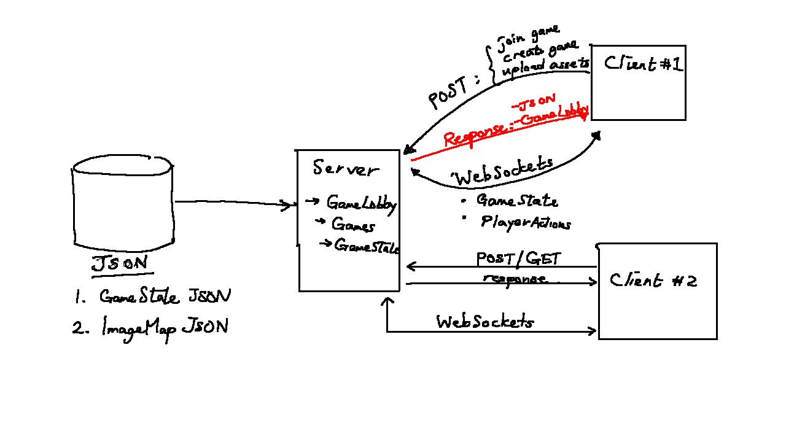
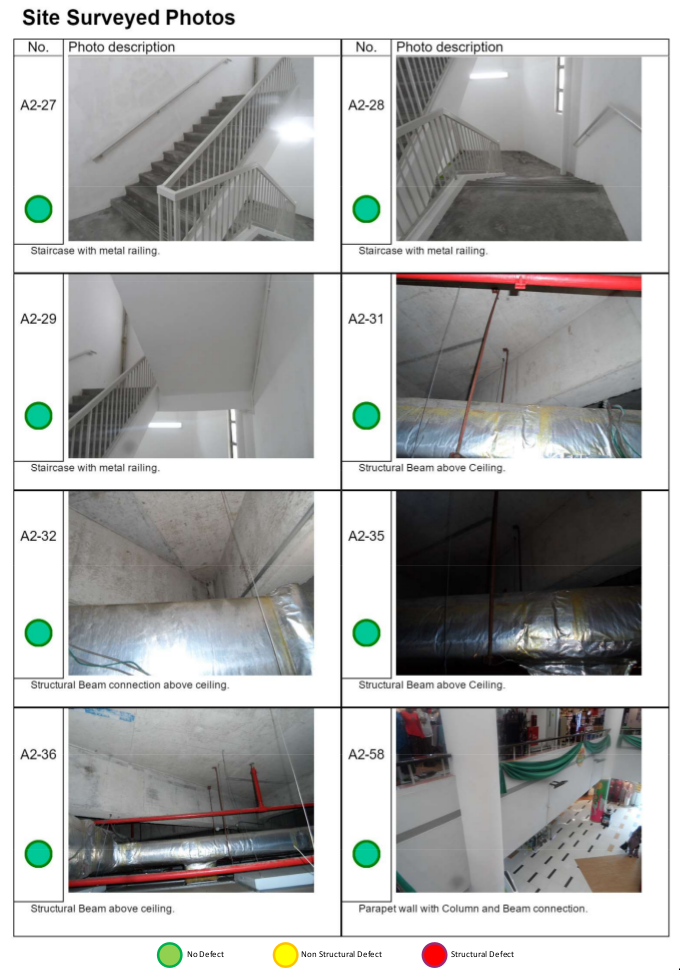

\pagebreak

## Introduction

I've confirmed the interview date with OGP on 7th October 2020, 4pm to 6pm.

From the [OGP Interview Guide (GDocs link)](https://docs.google.com/document/d/1Y0X2hatsN-kbzVu9ICVJyeB67V1PyrqtOV7Cg94Btc4/edit):

> We will be looking at your resume and getting you to share more about what
> you have worked on in the past. We’re interested in depth instead of breadth,
> so err on the side of specificity. Be prepared to share technical details
> about what you’ve worked on, including drawing diagrams on the whiteboard if
> necessary (for on-site interviews).

> In particular, we’re trying to answer the following questions about you:
>
> - What did you do?
> - How is it impressive?
> - How did you do it?

> In addition, we’re very interested in finding out how you think and how you
> work, so it would be useful to come prepared to explain any interesting
> engineering decisions that you had to make in the course of your work.

So what I'm going to do:

1. Keep practicing leetcode (but i think this is lower priority atm)
2. Write "talking points" for each of my projects:
   - what was it?
   - why was it important?
   - what was the architecture?
     - prepare diagram, talk about data flow.
     - what was the stack?
     - what were the interesting technical decisions I
       made?
   - any interesting technical challenges?
   - what mistakes did I make/what would I change if I were doing it now?
   - what have I learned?
3. Prepare answers to behavioural questions:
   - favourite project?
   - tell me about a time you had a disagreement/made a mistake ...

Ask them why they decided to join the company. Ask them what they think the
company could improve at. Ask them about a time that they messed up and how
it was handled. Ask them how they see themselves growing at this company in
the next few years. Ask them what they wish someone would have told them
before they joined. Ask them if they ever think about leaving, and if they
were to leave, where they would go.

---

## Board game engine

### Brief background/motivation

I like board games --- playing and designing them.
During Covid 19, my friends and I wanted to prototype and playtest a
board game together,
but we couldn't find a good tool to do so. There were several tools online
but they just didn't fit the bill.

I wanted to build something that
made it super easy to create and play any board game online with friends
with no downloads or programming skill needed.
Ideally you'd first specify a board game with a JSON file or with a GUI editor,
then upload the game, then host a game and send your friends the link ---
everything should be seamless.

### What it was

The board game engine is made out of three main parts.

First, it's the schema that allows anyone to specify
and render any board game with just two JSON files.

Second, it's the core multiplayer engine that synchronises player input
and maintains an authoritative game state between all the different players.

Lastly, it'll be the "supporting infrastructure": a database
to allow players to upload JSON files, some front-end that allows players to
host and join games, etc.

I'm currently working with two fellow gamedevs I met during an online Game Jam.
The first part (JSON schema) is completed, and we're almost done with the MVP
of the second part.

### Why it was impressive/ why it was important

This is a passion side project so progress is pretty slow.
But I've done quite a lot of market research and I know that
there's nothing like this in the market.
In terms of web,
the closest is something like Cockatrice/Lackey for multiplayer card games
or Roll20 for Dungeons and Dragons, but these are not ideal for board games.
So we're filling a small niche here --- the ability to prototype and playtest
quickly is really useful for board game nerds.

### What was the architecture?

#### Diagram



This is a client-server architecture. We have clients that send

Right now, a single server handles both the HTTP requests and Websockets communication.
For scale in the future, we would probably want to separate the server that
serves the static assets and handles the HTTP GET/POST requests
from the game server that does the heavy lifting of synchronising player input
and game state over WebSockets.

#### Dataflow and stack

Because we're designing for web, the only real choice is Javascript.

I decided to use TypeScript because I find types one of the most important things
I use to reason about complicated code, especially complicated OOP code.
With TypeScript I can define custom structs and interfaces and
that makes writing class methods so much easier.

#### Interesting technical decisions I made?

It was actually very very fun to design the schema that allows us to represent
any board game state. I guess you could kind of call it a domain-specific language
in a way.

It's useful to think think of a board game state as a state in a
finite state automaton,
and an action like drawing a card/flipping a card/playing a piece
as a transition between one state to another.
Then you need to think about what sort of things you need to have in the state.
Eventually I settled on a 'entity/zone' dichotomy
where the only possible transitions are:

- Moving an entity from one zone to another
- Changing an entity's state

Pair programming is SUPER useful and I wish I'd done it earlier.
It's incredibly useful for several reasons:

1. A lot of the time, the problem with side projects is that I just lack motivation
   to carry on. So pair programming works as a commitment device.
2. When one person gets blocked the other can help. A lot of the time
   one person has a faulty assumption that just block them from understanding a concept.
   Through a process of argument and discussion these assumptions can be uncovered.

Here's an example. The other collaborator is a very experienced data scientist
but has no JS experience. He had an incorrect understanding of `async` and `await`
(specifically, he didn't believe that `await` blocked execution)
and thus he rewrote my code wrongly. But after the discussion we managed to solve it.

### Interesting technical challenges?

Hardest technical challenge by far was doing real-time multiplayer.

First of all you need to think about how to structure the GameState object
and what you need to send to the server.

Why? Because you need to think about latency.

- How often should clients communicate with the server? We must ensure that the
  server is not overloaded and is able to respond to all the actions in time.
- If you don't allow clients to do anything until the server responds, it's going
  to feel very laggy. But if you allow clients to do too much then you get
  rubberbanding which also sucks.
- How does the server adjudicate between two different conflicting action sets?
- What happens if two players try to drag the same token at the same time?

Another interesting challenge was trying to work with others who were not as
technically experienced/didn't know the whole system as well as I did.
I had to learn how to portion out tasks in a bite-sized manner with defined
inputs and outputs so that contributors don't have to know the whole system
to contribute. This also forced me to go back and refactor in order to be able
to do that so it definitely increased the quality of my code.

Here's an example. We want a menu to display when we right-click on an entity.
This needs to access the GameState and Entity object to know what entity is being
clicked and what sort of menu to display and what function to call when a certain
menu option is clicked etc.

To write this function you need to know GameState, Entity, State interfaces.
What I had to do was refactor to hide all of this into a function, that simply
receives an (x, y) Point and a custom MenuObject, and all the contributor
had to do was `createDOMElement` according to the well-defined MenuObject.
So now they only need to understand that one MenuObject interface and they can
focus on that alone and they odn't have to worry about the rest --- well-encapsulated.

### What mistakes did I make and what would I change if I were doing it now?

Be more proactive when looking for blockers that other people are facing

Absolutely do pair programming earlier: not just pair programming but pair
understanding and pair reading documentation.

### What have I learned?

---

## Parallel processing package (R3PO)

### Brief background/motivation

During my one-month stint this summer with Inzura, I was tasked to perform
clustering on around 3 million JSON files to identify different trip modalities
(car/bus/plane).
The first step in the data science pipeline is to gather and process data.
Because we had about 3 million JSON files, a serial solution
would take way too long. I wrote a parallel processing package using Ray
that sped up the time taken to process all the files by ~12x.

### What it was

It's a parallel processing Python package that makes embarassingly parallel
tasks embarassingly easy.
The library automatically handles the distribution of tasks to processes.
Because we didn't want to lose any progress if e.g. the machine failed, the
library also saves your progress so you can stop and restart the job anytime,
and logs all errors automatically.

### Why it was impressive/ why it was important

It sped up the time taken to process all the files by ~12x,
and because Inzura had a need for parallelising many other workflows like this--
(also they wanted their cluster of hundreds of Raspis to use)
this will come in very useful for their future data processing workflows

### What was the architecture?

The user writes a `config.yaml` file in lieu of a CLI that specifies
how many processes to run, what the input and output folders are, etc.

Then the package itself has two files: `jobbuilder` and `jobrunner`.

Suppose we want to specify 12 parallel processes.
The `jobbuilder` looks at all the JSON files, and does the "load balancing":
essentially carving up all the files amongst the different 12 processes.
The `jobrunner` then will run some user-defined function `f`
on each of the files in parallel
and will save the results in 12 different `.csv` files.

#### Diagram

NA

#### Dataflow and stack

This pipeline runs a function f on a large number of input files in parallel
and logs the results into a CSV. It is made up of two files.

The first file, jobbuilder.py, takes an input (source) directory and produces
nodejobfile text files that tell each process which files to work on.

Then the second file jobrunner.py spins up the processes. Each process looks
at its nodejobfile text file, and works through the list. For each \$FILEPATH
listed in nodejobfile, the process opens the file, runs some function f on
that file, and appends the output to a .csv file.

If the function successfully runs, an empty file called done.job is created
in <$WORKING_DIR>/tracking/<$FILEPATH>/as a record of completion. If the
function throws an exception, then an empty file called error.job is created
in the directory instead. Keeping a record of file completion means that the
processes can be terminated and restarted at any time without going through
the same files again.

config.yaml:

```yaml
job_name: count_produce
output_path: /home/lieu/dev/r3po/sample/output_dir
processes: 2
source_file_part: .json
source_path: /home/lieu/dev/r3po/sample/produce_log
working_dir: /home/lieu/dev/r3po/sample/working_dir
```

main.py:

```python
from r3po import jobbuilder, jobrunner

# Import the function that will be called by your processes

from count_fruits import count_fruits

CONFIG_YAML_FP = './config.yaml'

# Build jobs

jobbuilder.build_jobs(CONFIG_YAML_FP)

# Run jobs

jobrunner.run_jobs(CONFIG_YAML_FP, count_fruits)
```

This will run the function count_fruits on all the .json files in
source_path, and save the results as CSVs in output_path (one row per JSON
file).

### Interesting technical decisions I made?

1. Whether or not to use the Ray library --- could have done something similar with Python's multiprocessing library
   - KISS vs NIH
   - Ray's logging features, good documentation, and
     dashboard (useful for long-running jobs) won me over in the end
2. How abstract do we want to go --- do we make the library more abstract/powerful
   (in the sense of being able to handle functions that follow a less strict contract)
   at the expense of simplicity?
   - Something like MapReduce is very general
   - In the end, I decided to go for simple and specific:
     (forcing a particular kind of workflow). I did this because I didn't just
     want to badly reimplement MapReduce.

### Interesting technical challenges?

Not so much a technical challenge, more of a deliberate technical decision.

The user-defined function `f` is very restrictive:

> The function you call must take as input an absolute filepath to the file.
> It must return a Dictionary that will be passed to csv.DictWriter.
> Furthermore, every Dictionary object returned must have the same keys. If it
> is not able to return such a Dictionary, it must raise an Exception.

Note that the function can't take any other arguments apart from the filepath
to the file.
(there is no state you can pass to the function)

While it would be easy to do so I elected not to do this because this would
open up "wrong" ways to use the package,
and users would have to understand what kind of arguments you can pass and

There was a very interesting and weird bug that I found
where for some reason the first row of the CSV was being written twice.

After some debugging I saw that even after `csvWriter.writeRow`
the filesize did not increase.

And after even more debugging I saw that
`os.stat`/`os.fstat` and `outfile.tell` gave different filesize results
for some reason.

```python
(pid=963792) File size according to os.fstat(outfile.fileno()).st_size: 0
(pid=963792) File size according to os.stat(outputfilepath).st_size: 0
(pid=963792) File size according to outfile.tell: 0
(pid=963792) Processed trip /home/lieu/dev/r3po/output_dir/0.results.csv in node 0.
(pid=963792) File size according to os.fstat(outfile.fileno()).st_size: 0
(pid=963792) File size according to os.stat(outputfilepath).st_size: 0
(pid=963792) File size according to outfile.tell: 34
(pid=963792) Processed trip /home/lieu/dev/r3po/output_dir/0.results.csv in node 0.
(pid=963792) File size according to os.fstat(outfile.fileno()).st_size: 34
(pid=963792) File size according to os.stat(outputfilepath).st_size: 34
(pid=963792) File size according to outfile.tell: 46
(pid=963792) Processed trip /home/lieu/dev/r3po/output_dir/0.results.csv in node 0.
(pid=963792) File size according to os.fstat(outfile.fileno()).st_size: 46
(pid=963792) File size according to os.stat(outputfilepath).st_size: 46
(pid=963792) File size according to outfile.tell: 58
(pid=963792) Processed trip /home/lieu/dev/r3po/output_dir/0.results.csv in node 0.
(pid=963792) File size according to os.fstat(outfile.fileno()).st_size: 58
(pid=963792) File size according to os.stat(outputfilepath).st_size: 58
(pid=963792) File size according to outfile.tell: 68
(pid=963792) Processed trip /home/lieu/dev/r3po/output_dir/0.results.csv in node 0.
(pid=963792) File size according to os.fstat(outfile.fileno()).st_size: 68
(pid=963792) File size according to os.stat(outputfilepath).st_size: 68
(pid=963792) File size according to outfile.tell: 82
```

It turned out that `outfile.seek(0,2)` actually affects the result
of `os.stat(outputfilepath)` and `os.fstat(...)`. This is quite unexpected
behaviour because `os.stat(filepath).st_size` is supposed to return
the "Size in bytes of a plain file" so why would it be affected by outfile.seek?
It also means that [this accepted and top-rated SO answer](https://stackoverflow.com/questions/283707/size-of-an-open-file-object)
is actually wrong.

### What mistakes did I make and what would I change if I were doing it now?

I put the package up on a public GH repo to make it very easy to install
(uploaded it to PyPi which allows it to be `pip3 install`ed)
but I didn't clear it with the CEO first.
I (incorrectly) assumed that since this was a general-purpose package
with no sensitive company data it would be OK.
But CEO understandably wanted to keep IP he was paying him for to himself.

### What have I learned?

- How to build and deploy a package
- Very niche bug on fstat and stat
- Ask permission before deploying

---

## MGGG flagship webapp

### Brief background/motivation

Districtr is a districting app where you can
"colour in" districts using a brush tool.
The team wanted to give users some additional context about the
districts they drew:
is your plan valid, and
how "good" is your plan compared to other districting plans?
So I built a new feature to calculate and display this info in real time.

### What it was

My contribution can be seen in the bottom right corner of the below GIF. As
you draw the districts with the brush, three metrics update in real time:

- the contiguity status (whether districts drawn are one continuous whole or get broken up in the middle);
- The number of cut edges;
- How the number of cut edges compares to a sample of plans generated by the Recom redistricting algorithm

### Why it was impressive/ why it was important

This was something the team thought would improve the user experience
greatly and improve the quality of submitted districting plans.

### What was the architecture?

A very simple client-server architecture.
I set a server up with Flask living on `pythonanywhere.com` for \$20 a month
and it was good enough to serve all of the users.

#### Diagram

Too simple to merit a proper diagram.

```
+-----------------+                  +-------------------+
|                  | POST request    |                   |
|                  +----------------->                   |
|  SPA MGGG Webapp |                 |  Flask server     |
|                  |   JSON response |                   |
|                  <-----------------+                   |
| Render response  |                 |                   |
+-----------------+                  +-------------------+
```

#### Dataflow and stack

The Webapp was using a stack I didn't choose: something called LitHTML
which is similar to React in purpose.

I used the Fetch API to send the POST request,
Flask for the server,
Gerrychain to calculate the metrics,
and Vega + HTML5 Canvas to display the dynamic histogram.

There's an SPA Webapp that sends a POST request to the Flask server
as the user draws the districts.

The Flask server receives the district assignment
and calculates the metrics using a Python library called Gerrychain,
then responds to the request with the calculated metrics.

#### Interesting technical decisions I made?

The most interesting technical decision was actually a counterintuitive choice
to keep things as simple as possible.

1. Calculate on client-side or server-side?
2. Send deltas or full district assignment?

Send client-side vs server-side: we were worried about latency when sending
large amounts of cut edges through and thought it would be better to offload
the computation to the client. But calculating client-side would mean a
longer first-load latency as it needs to download the dual graphs, and it would
also mean rewriting many of the functions already available in Python again in
Javascript. Eventually ruled in favour of server-side computation.

Another way I considered to increase performance was to not send the full
district assignment (a dictionary of int:int pairs) but rather only the
deltas (the assignments that have changed since the last district assignment).
I decided that this was more trouble than it was worth since that would mean
the server would have to maintain state.

### Interesting technical challenges?

The app and my contribution are both quite simple but the most difficult bit was
trying to understand the dataflow of the existing application.
When you build something from scratch you have a tacit or explicit understanding
of how the data flows through the entire architecture. But when trying to contribute
you don't have this understanding. Which components talk to which other components?
What does a component need to render? Etc. Before writing a single line of code
I needed to wrap my head around this, and it was especially difficult because I
had no experience working with existing codebases as large as this.

### What mistakes did I make and what would I change if I were doing it now?

1. Autoformatter autoformatted the entire file when I added my own code to the file
   and the SWE was not able to review my PR properly --- had to manually undo
   all the autoformatting, which was quite painful.
2. Spent a day thinking about how to horizontally scale up the server,
   thinking about load balancers and so on, changing to Julia,
   when the first thing I should have done
   was to immediately start benchmarking how long each bit takes. It turned out
   that the main bottleneck was converting the JSON file into a dual graph format
   and it sufficed to simply cache that converted dual graph to get >50x speedups.

### What have I learned?

- How to understand an external codebase --- need more practice on this
- How to collaborate with other developers using GitHub forks, `git branch`,
  `git merge` etc.
- Always benchmark before thinking too hard:
  they say "premature optimisation is the root of all evil",
  and "premature _thinking about_ optimisation" must come a close second.

---

## Bayesian SMS sender

### Brief background/motivation

Inzura is an auto insurance startup. They collect GPS data on drivers using
their

### What it was

### Why it was impressive/ why it was important

### What was the architecture?

#### Diagram

#### Dataflow and stack

#### Interesting technical decisions I made?

### Interesting technical challenges?

### What mistakes did I make and what would I change if I were doing it now?

### What have I learned?

---

## Distributed Raspberry Pi cluster

### Brief background/motivation

### What it was

### Why it was impressive/ why it was important

### What was the architecture?

#### Diagram

#### Dataflow and stack

#### Interesting technical decisions I made?

### Interesting technical challenges?

### What mistakes did I make and what would I change if I were doing it now?

### What have I learned?

---

## Blocktrain (Blockchain demonstrator)

### Brief background/motivation

### What it was

### Why it was impressive/ why it was important

### What was the architecture?

#### Diagram

#### Dataflow and stack

#### Interesting technical decisions I made?

### Interesting technical challenges?

### What mistakes did I make and what would I change if I were doing it now?

### What have I learned?

---

## Bespoke building inspection software (Inspector's Gadget)

Had written some thoughts on it [here](https://github.com/lieuzhenghong/inspectors-gadget/blob/master/what-i-learned.md)
and
[here](https://lieuzhenghong.com/projects/inspectors-gadget/)

### Brief background/motivation

I wrote this for my dad's civil engineering consultancy firm because he was
complaining that making these reports took up too much time.
He asked me to use AI/machine learning to identify building defects in a photo
and I said I don't think I can do that.
After talking to him and his engineers I realised that there was no need for
any machine learning, the main bottleneck was that they were using really
inefficient tools (Microsoft Excel and Word) to generate the building reports.
So I built a custom app that streamlined their workflow greatly and saved them
hundreds of engineer-hours a month: time taken to generate a report decreased by
75-85%.

### What it was

Inspector's Gadget is a bespoke desktop application written in ElectronJS
that was custom-built for a civil engineering consulting firm. It streamlines
the process of writing building inspection reports. Real-world usage reports
show that it decreases the time taken to write a report by up to 85%.

### Why it was impressive/ why it was important

I really enjoy the idea of building software that helps someone streamline their workflow
It's a good feeling to know that your software is being used by users
I also like the feeling of being able to create a piece of software all the way from ideation to production; it gives me a sense of accomplishment

### What was the architecture?

#### Diagram

#### Dataflow and stack

Before understanding the application flow, you must first understand the
process of generating a building inspection report.

A building inspection report is done as follows:
An engineer walks around the building and takes photos of all structural features and defects (if any). The engineer will then "tag" the floor plan---put labels on the floor plan to show where each photo was taken. Finally, the engineer will produce a PDF report which includes all the photos taken, a description of each photo, and a classification of the defect type.

Application flow is as follows:

1. Enginer has a floor plan and a folder full of photos
2. Engineer uploads floor plan and photos
3. Engineer clicks floor plan to assign a photo to that position on the floor plan
4. Engineer goes to "Generate report" tab to describe each photo
5. PDF automatically generated

The entire thing was built in JavaScript.
I used Vue.js for building the front-end
and Electron to package it as a desktop app for both Windows and Mac users.
I used a library called localForage (local file storage)
to store and export annotated floor plans
so that engineers could share their work with each other.

### Interesting technical decisions I made?

I think I was considering Electron vs Qt and eventually settled on Electron
just because I knew how to build UIs with HTML and I'd have to learn more stuff
to be familiar with Qt. I was on a tight deadline of ~1 month to ship the app
so I went with what I knew (more).

### Interesting technical challenges?

There were technical challenges relating to wrangling with the PDF generator
library but I can't remember the specifics.

The more interesting challenge was actually finding out what the user actually
needed instead of what the users told me they needed.
My dad first approached me asking me to do some machine learning system
but I sat down with him and his other engineers to try and understand
what their workflow was.

And I realised that what they really needed was not any fancy ML feature
. First, every photo taken was renamed in File
Explorer. Then, the floor plan was tagged in Microsoft Word by manually
creating Text Boxes and moving them to the desired spot. Finally, to generate
the report, the engineers would paste the images one by one into the Word
document. God forbid the engineer missed out one photo in the middle, as to
insert the new photo all subsequent photos had to be cut-and-pasted one box
down. (You can see an example in the image: the image A2-30 has been left
out. That means all the images and text from A2-31 onwards have to be cut and
pasted one box down to make space for the new image.)



I also realised that discoverability is very important.
I had added in some keyboard shortcuts but forgot to tell the engineers
(I documented it in a README which---let's face it---nobody reads)
and then the engineers complained that their work was mysteriously being wiped!
I debugged for days but couldn't find the solution.

It turned out that
I had implemented something like Control-Shift-L to load the previous saved
plan but this actually just overwrote whatever they were working on now.
And some engineers must have pressed this somehow by accident.
So I simply removed it and there were no more complaints.

### What mistakes did I make and what would I change if I were doing it now?

- Talk to users more when building the app.
  - e.g. the case of keyboard shortcuts, which ones users want and which ones
    they dont
- Observe how users use the app and use that to guide building new features

### What have I learned?

- First time using Electron
- First time building a desktop GUI app
- The importance of talking to users and find out what they want

---

## Dropship Chess

### Brief background/motivation

### What it was

### Why it was impressive/ why it was important

### What was the architecture?

#### Diagram

#### Dataflow and stack

#### Interesting technical decisions I made?

### Interesting technical challenges?

### What mistakes did I make and what would I change if I were doing it now?

### What have I learned?
